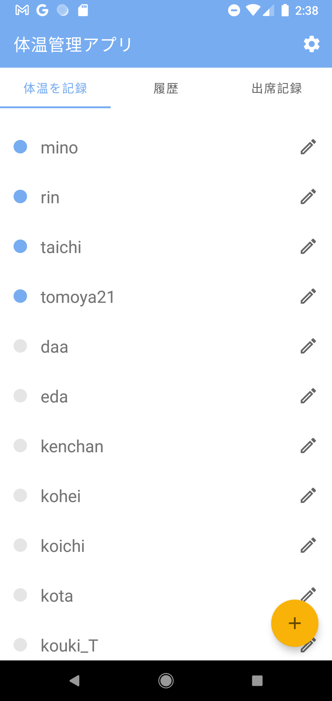
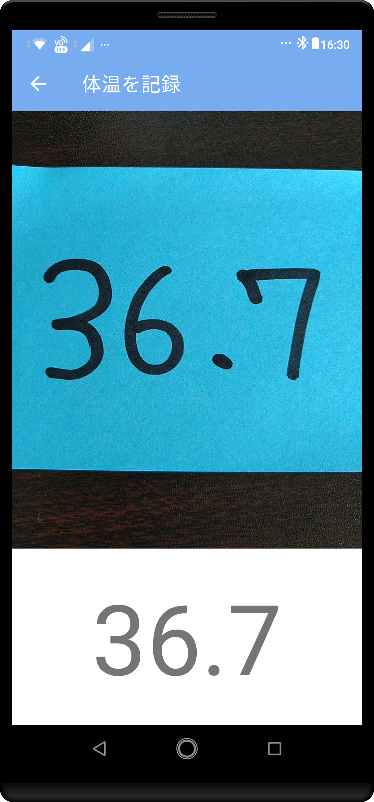
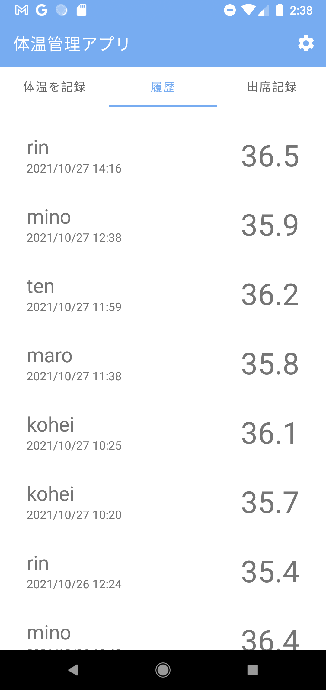
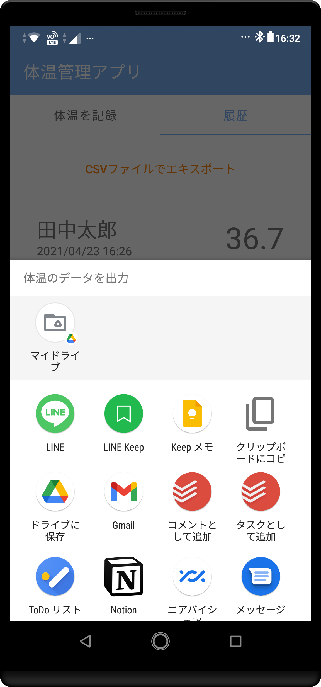

# 体温管理アプリ
## 機能一覧
## 体温を記録
- 画像認識により体温計の結果を自動で入力
- 付近にいるユーザーをBluetoothにより検出することで、入力者の指定をスムーズにする。




### 記録を管理
- 記録した体温をCSV形式で出力




## 設計


## CSVからユーザーを追加
以下の形式に従う`CSV`ファイルからユーザーを追加できます。
```csv
ユーザー名, BluetoothのMACアドレス, 学位
```
```csv
学位=B4|M1|M2|Prof|Grad
```