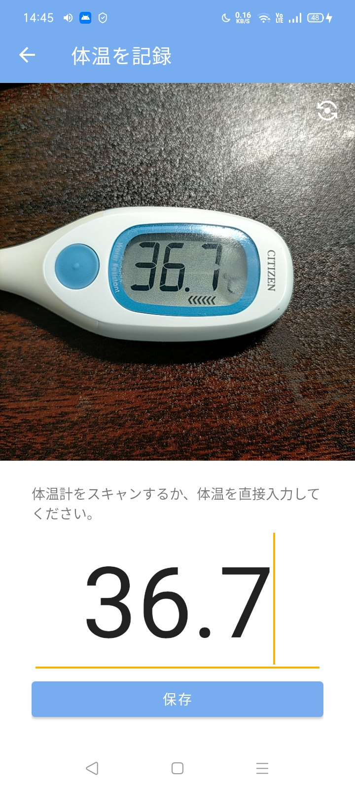
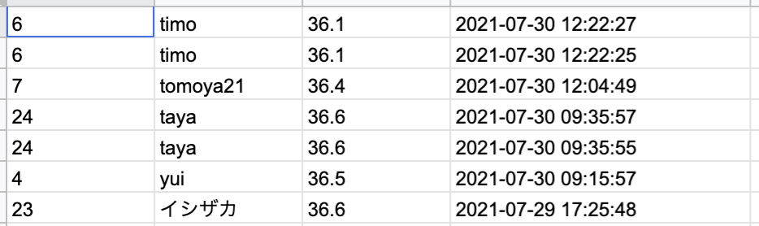

# 体温管理アプリ

## 機能一覧

## 体温を記録

- 画像認識により体温計の結果を自動で入力
- 付近にいるユーザーをBluetoothにより検出することで、入力者の指定をスムーズにする。

### 記録を管理

- 体温をSpreadSheetに自動で記録

- アプリから確認することも可能

## 設計

## 必要なファイル

|ファイルの説明|ファイル名|ファイルパス|
|---|---|---|
|サービスアカウントの秘密鍵|service_account.json|app/main/assets/service_account.json|
|Firebaseの秘密鍵|google-services.json|app/main/google-services.json|